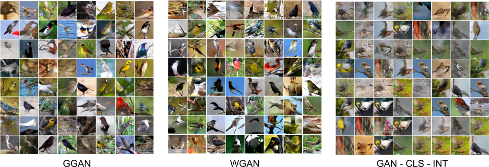
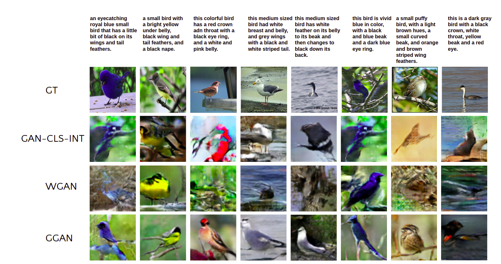

# Text2Image

### Results
#### Generated Images

#### Text to image synthesis

### How To RUN

### References

[https://github.com/pytorch/examples/tree/master/dcgan](https://github.com/pytorch/examples/tree/master/dcgan)   
[https://github.com/tobran/DF-GAN](https://github.com/tobran/DF-GAN)  
[https://github.com/aelnouby/Text-to-Image-Synthesis](https://github.com/aelnouby/Text-to-Image-Synthesis)    
[https://github.com/reedscot/icml2016](https://github.com/reedscot/icml2016)   
[https://github.com/hanzhanggit/StackGAN-inception-model](https://github.com/hanzhanggit/StackGAN-inception-model)  
[https://github.com/taoxugit/AttnGAN](https://github.com/taoxugit/AttnGAN)